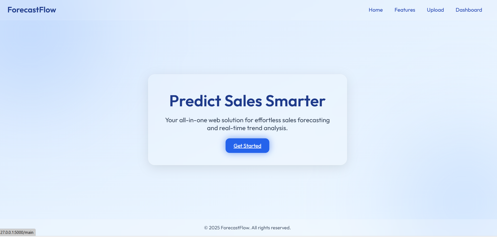
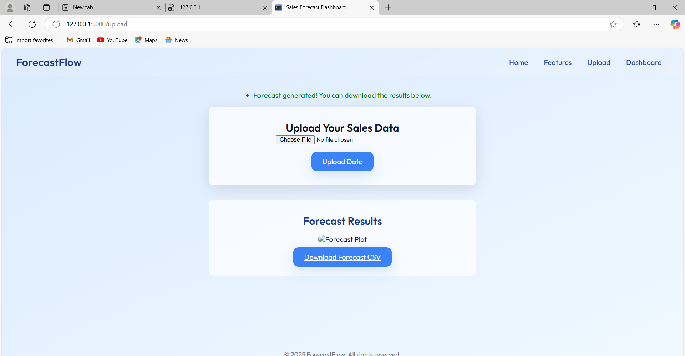
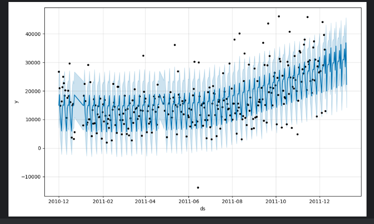

# ForecastFlow
ForecastFlow is an intelligent sales forecasting solution that leverages machine learning algorithms to accurately predict future sales trends based on historical data. Designed for e-commerce and retail businesses, the system empowers decision-makers with actionable insights to optimize inventory, marketing, and financial planning.

>  
>  
>  
>  
